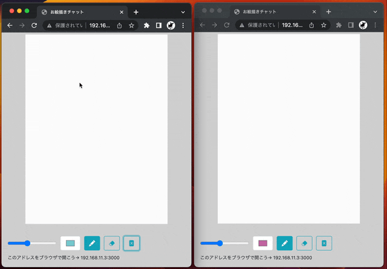

# Paint Chat

Paint Chatは、ローカルで動作するマルチプレイヤーのお絵描きチャットアプリです。家族・友達・学校など、同じWifi環境の中で動いているマシンであれば、誰でも参加できます。同じページを開いているユーザーがリアルタイムでお絵描きを共有できます。
最低限の機能のみが実装されています。



## 機能

- ペンの太さを変更するスライダー
- 色を変えるパレット
- 消しゴム
- 全消しボタン
- マウスとタッチ操作に対応

## 必要な環境

- Mac、WindowsまたはLinuxのマシン
- マシンにNode.jsとgitがインストールされている必要があります。
- 複数のデバイスを使うときは、同じWifi環境下に接続されている必要があります。

## インストールと実行

1. このリポジトリをクローンまたはダウンロードします。

```bash
git clone https://github.com/utabi/paint-chat
```

2. プロジェクトのディレクトリに移動します。

```bash
cd paint-chat
```

3. 必要な依存関係をインストールします。

```bash
npm install
```

4. サーバーを起動します。（Macの場合は start.command クリックでもOK ）

```bash
node server.js
```

5. ブラウザで `http://localhost:2525` を開いてアプリケーションを開始します。

6. 画面最下部に「このアドレスをブラウザで開こう→」と書かれているURLがあります。別のデバイスから接続するには、ブラウザを開き、アドレスバーにこのURLを入力してください。


## ライセンス

[MIT](LICENSE)
